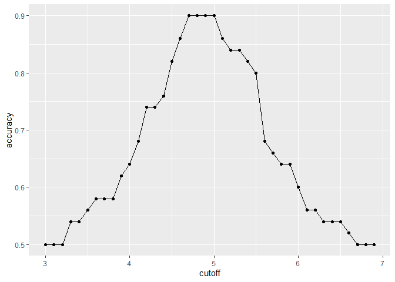

Journey through Data Science: Machine Learning
================
Matt Bartley
4/30/2021

## Section 1: Introduction to Machine Learning

The introduction section highlights some beginner concepts in machine
learning. Specifically:

  - Outcomes are something that we want to predict and the features are
    the information we will use to make the prediction.

Goals for this section: \* Explain the difference between the outcome
and the features \* Explain when to use classification and when to use
prediction \* Explain the importance of prevalence \* Explain the
difference between sensitivity and specificity

## Section 2: Machine Learning Basics

We want to predict sex using height. Note that sex in this example is a
categorical variable with two possible outcomes: male, or female. We
start by using the simplest possible model which is to randomly guess.
Generally when training machine learning algorithms, we separate our
data into a training set and a validation set. We can use the
*createDataPartition* function from the *caret* package. While we will
perform this step initially, a random guess is not a machine learning
algorithm and hence we will not require the training set to test
performance on this approach.

``` r
# load the data set
data(heights)


# define the outcome and predictors (or label and features)
y <- heights$sex
x <- heights$height

# generate training and test sets
set.seed(2, sample.kind = "Rounding")
```

    ## Warning in set.seed(2, sample.kind = "Rounding"): non-uniform 'Rounding' sampler
    ## used

``` r
test_index <- createDataPartition(y, times = 1, p = 0.5, list = FALSE)
test_set <- heights[test_index,]
train_set <- heights[-test_index,]


# guess the outcome and compute accuracy
y_hat <- sample(c("Male", "Female"), length(test_index), replace=TRUE) %>%
  factor(levels = levels(test_set$sex))
test_set %>% summarise(accuracy = mean(y_hat == sex))
```

    ##    accuracy
    ## 1 0.4628571

``` r
# examine the distribution of heights by gender
heights %>% group_by(sex) %>% summarise(mean(height), sd(height))
```

    ## # A tibble: 2 x 3
    ##   sex    `mean(height)` `sd(height)`
    ##   <fct>           <dbl>        <dbl>
    ## 1 Female           64.9         3.76
    ## 2 Male             69.3         3.61

``` r
heights %>% ggplot(aes(height, group=sex, colour=sex)) + geom_density()
```

<!-- -->

``` r
heights %>% group_by(sex) %>% summarise(n = n()) %>% ungroup() %>% mutate(p = round(100*n/sum(n),1))
```

    ## # A tibble: 2 x 3
    ##   sex        n     p
    ##   <fct>  <int> <dbl>
    ## 1 Female   238  22.7
    ## 2 Male     812  77.3

``` r
# obtain delta in height densities between males and females
heights.min <- min(heights$height)
heights.max <- max(heights$height)
density.male <- density(heights %>% filter(sex == "Male") %>% pull(height), from=heights.min, to=heights.max)
density.female <- density(heights %>% filter(sex == "Female") %>% pull(height), from=heights.min, to=heights.max)
density.diff <- density.male$y - density.female$y
density.intersect <- density.male$x[which(diff(density.diff > 0) != 0) + 1][1]


# use a height cutoff to guess the gender instead of random guess
y_hat <- ifelse(x > density.intersect, "Male", "Female") %>% factor(levels = levels(test_set$sex))
test_set %>% summarise(accuracy = mean(y_hat == sex))
```

    ##    accuracy
    ## 1 0.5933333

``` r
# iterate over possible cutoff points
cutoff <- seq(61, 70)
accuracy <- map_dbl(cutoff, function(x){
  y_hat <- ifelse(train_set$height > x, "Male", "Female") %>% 
    factor(levels = levels(test_set$sex))
  mean(y_hat == train_set$sex)
})
data.frame(cutoff, accuracy) %>% 
  ggplot(aes(cutoff, accuracy)) + 
  geom_point() + 
  geom_line() 
```

<!-- -->

``` r
max(accuracy)
```

    ## [1] 0.8361905

``` r
best_cutoff <- cutoff[which.max(accuracy)]
best_cutoff
```

    ## [1] 64

``` r
y_hat <- ifelse(test_set$height > best_cutoff, "Male", "Female") %>% 
  factor(levels = levels(test_set$sex))
y_hat <- factor(y_hat)
mean(y_hat == test_set$sex)
```

    ## [1] 0.8171429

Notice that the success of our random guess approach is as expected,
roughly **50%**. We improve upon this by using the cutoff which
represents the intersection point of the densities, obtaining an
accuracy of close to **60%**. We further improve about this by iterating
over additional cutoff points on our training data to achieve an
accuracy of **82%** on our test set with a cutoff height of 64.

Now we take a look at the confusion matrix and additional measures of
accuracy.

**Sensitivity** (or *Recall*) is a measure of an algorithm’s ability to
accurately predict a positive outcome. In other words, it is the
percentage positive cases that are identified by the algorithm. This is
calculated as: \[Sensitivity=\frac{TP}{TP + FN}\]

**Specificity** is the measure of the algorithm’s ability to accurately
predict a negative outcome. Similar to above, it is the percentage of
negative cases that are identified by the algorithm. This is calculated
as: \[Specificity=\frac{TN}{TN + FP}\]

``` r
# tabulate each combination of prediction and actual value
table(predicted = y_hat, actual = test_set$sex)
```

    ##          actual
    ## predicted Female Male
    ##    Female     50   27
    ##    Male       69  379

``` r
test_set %>% 
  mutate(y_hat = y_hat) %>%
  group_by(sex) %>% 
  summarise(accuracy = mean(y_hat == sex))
```

    ## # A tibble: 2 x 2
    ##   sex    accuracy
    ##   <fct>     <dbl>
    ## 1 Female    0.420
    ## 2 Male      0.933

``` r
prev <- mean(y == "Male")

confusionMatrix(data = y_hat, reference = test_set$sex)
```

    ## Confusion Matrix and Statistics
    ## 
    ##           Reference
    ## Prediction Female Male
    ##     Female     50   27
    ##     Male       69  379
    ##                                           
    ##                Accuracy : 0.8171          
    ##                  95% CI : (0.7814, 0.8493)
    ##     No Information Rate : 0.7733          
    ##     P-Value [Acc > NIR] : 0.008354        
    ##                                           
    ##                   Kappa : 0.4041          
    ##                                           
    ##  Mcnemar's Test P-Value : 2.857e-05       
    ##                                           
    ##             Sensitivity : 0.42017         
    ##             Specificity : 0.93350         
    ##          Pos Pred Value : 0.64935         
    ##          Neg Pred Value : 0.84598         
    ##              Prevalence : 0.22667         
    ##          Detection Rate : 0.09524         
    ##    Detection Prevalence : 0.14667         
    ##       Balanced Accuracy : 0.67683         
    ##                                           
    ##        'Positive' Class : Female          
    ## 

Note that in situations where prevalence is low, precision becomes a
more important metric. Precision is the given by the proportion of
predicted positive cases that are actually positive. Formulaically:

\[Precision = \frac{TP}{TP+FP}\]

It is sometimes convenient to have a single numeric representation of
the model’s performance. For this we can consider either balanced
accuracy or the F1 score. These are the arthimetic mean and harmonic
mean respectively, of precision and recall. The harmonic mean is often
used when averaging rates as in the example the average speed of a car.
If a car travels at 60km/h for 20km and 40km/h for 10km, the correct
average speed cannot be obtained by the arithmetic mean (50km/h) as it
does not account for the amount of time traveling at the two distinct
speeds.

\[Balanced Accuracy = \frac{Precision + Recall}{2}\]
\[F1 Score = 2\times\frac{precision \times recall}{precision + recall}\]

``` r
# maximize F-score
cutoff <- seq(61, 70)
F_1 <- map_dbl(cutoff, function(x){
  y_hat <- ifelse(train_set$height > x, "Male", "Female") %>% 
    factor(levels = levels(test_set$sex))
  F_meas(data = y_hat, reference = factor(train_set$sex))
})

data.frame(cutoff, F_1) %>% 
  ggplot(aes(cutoff, F_1)) + 
  geom_point() + 
  geom_line()
```

<!-- -->

``` r
max(F_1)
```

    ## [1] 0.6142322

``` r
best_cutoff <- cutoff[which.max(F_1)]
best_cutoff
```

    ## [1] 66

``` r
y_hat <- ifelse(test_set$height > best_cutoff, "Male", "Female") %>% 
  factor(levels = levels(test_set$sex))

confusionMatrix(data = y_hat, reference = test_set$sex)
```

    ## Confusion Matrix and Statistics
    ## 
    ##           Reference
    ## Prediction Female Male
    ##     Female     81   67
    ##     Male       38  339
    ##                                           
    ##                Accuracy : 0.8             
    ##                  95% CI : (0.7632, 0.8334)
    ##     No Information Rate : 0.7733          
    ##     P-Value [Acc > NIR] : 0.078192        
    ##                                           
    ##                   Kappa : 0.4748          
    ##                                           
    ##  Mcnemar's Test P-Value : 0.006285        
    ##                                           
    ##             Sensitivity : 0.6807          
    ##             Specificity : 0.8350          
    ##          Pos Pred Value : 0.5473          
    ##          Neg Pred Value : 0.8992          
    ##              Prevalence : 0.2267          
    ##          Detection Rate : 0.1543          
    ##    Detection Prevalence : 0.2819          
    ##       Balanced Accuracy : 0.7578          
    ##                                           
    ##        'Positive' Class : Female          
    ## 

``` r
p <- 0.9
n <- length(test_index)
y_hat <- sample(c("Male", "Female"), n, replace = TRUE, prob=c(p, 1-p)) %>% 
  factor(levels = levels(test_set$sex))
mean(y_hat == test_set$sex)
```

    ## [1] 0.7161905

``` r
# ROC curve
probs <- seq(0, 1, length.out = 10)
guessing <- map_df(probs, function(p){
  y_hat <- 
    sample(c("Male", "Female"), n, replace = TRUE, prob=c(p, 1-p)) %>% 
    factor(levels = c("Female", "Male"))
  list(method = "Guessing",
       FPR = 1 - specificity(y_hat, test_set$sex),
       TPR = sensitivity(y_hat, test_set$sex))
})
guessing %>% qplot(FPR, TPR, data =., xlab = "1 - Specificity", ylab = "Sensitivity")
```

<!-- -->

``` r
cutoffs <- c(50, seq(60, 75), 80)
height_cutoff <- map_df(cutoffs, function(x){
  y_hat <- ifelse(test_set$height > x, "Male", "Female") %>% 
    factor(levels = c("Female", "Male"))
   list(method = "Height cutoff",
        FPR = 1-specificity(y_hat, test_set$sex),
        TPR = sensitivity(y_hat, test_set$sex))
})

# plot both curves together
bind_rows(guessing, height_cutoff) %>%
  ggplot(aes(FPR, TPR, color = method)) +
  geom_line() +
  geom_point() +
  xlab("1 - Specificity") +
  ylab("Sensitivity")
```

<!-- -->

``` r
library(ggrepel)
map_df(cutoffs, function(x){
  y_hat <- ifelse(test_set$height > x, "Male", "Female") %>% 
    factor(levels = c("Female", "Male"))
   list(method = "Height cutoff",
        cutoff = x, 
        FPR = 1-specificity(y_hat, test_set$sex),
        TPR = sensitivity(y_hat, test_set$sex))
}) %>%
  ggplot(aes(FPR, TPR, label = cutoff)) +
  geom_line() +
  geom_point() +
  geom_text_repel(nudge_x = 0.01, nudge_y = -0.01)
```

<!-- -->

``` r
# plot precision against recall
guessing <- map_df(probs, function(p){
  y_hat <- sample(c("Male", "Female"), length(test_index), 
                  replace = TRUE, prob=c(p, 1-p)) %>% 
    factor(levels = c("Female", "Male"))
  list(method = "Guess",
    recall = sensitivity(y_hat, test_set$sex),
    precision = precision(y_hat, test_set$sex))
})

height_cutoff <- map_df(cutoffs, function(x){
  y_hat <- ifelse(test_set$height > x, "Male", "Female") %>% 
    factor(levels = c("Female", "Male"))
  list(method = "Height cutoff",
       recall = sensitivity(y_hat, test_set$sex),
    precision = precision(y_hat, test_set$sex))
})

bind_rows(guessing, height_cutoff) %>%
  ggplot(aes(recall, precision, color = method)) +
  geom_line() +
  geom_point()
```

    ## Warning: Removed 1 row(s) containing missing values (geom_path).

    ## Warning: Removed 1 rows containing missing values (geom_point).

<!-- -->

``` r
guessing <- map_df(probs, function(p){
  y_hat <- sample(c("Male", "Female"), length(test_index), replace = TRUE, 
                  prob=c(p, 1-p)) %>% 
    factor(levels = c("Male", "Female"))
  list(method = "Guess",
    recall = sensitivity(y_hat, relevel(test_set$sex, "Male", "Female")),
    precision = precision(y_hat, relevel(test_set$sex, "Male", "Female")))
})

height_cutoff <- map_df(cutoffs, function(x){
  y_hat <- ifelse(test_set$height > x, "Male", "Female") %>% 
    factor(levels = c("Male", "Female"))
  list(method = "Height cutoff",
       recall = sensitivity(y_hat, relevel(test_set$sex, "Male", "Female")),
    precision = precision(y_hat, relevel(test_set$sex, "Male", "Female")))
})
bind_rows(guessing, height_cutoff) %>%
  ggplot(aes(recall, precision, color = method)) +
  geom_line() +
  geom_point()
```

    ## Warning: Removed 1 row(s) containing missing values (geom_path).
    
    ## Warning: Removed 1 rows containing missing values (geom_point).

<!-- -->

### Comprehension Check

``` r
dat <- mutate(reported_heights, date_time = ymd_hms(time_stamp)) %>%
  filter(date_time >= make_date(2016, 01, 25) & date_time < make_date(2016, 02, 1)) %>%
  mutate(type = ifelse(day(date_time) == 25 & hour(date_time) == 8 & between(minute(date_time), 15, 30), "inclass","online")) %>%
  select(sex, type)

y <- factor(dat$sex, c("Female", "Male"))
x <- dat$type

data(iris)
iris <- iris[-which(iris$Species=='setosa'),]
y <- iris$Species
```

``` r
dat %>% group_by(type, sex) %>% summarise(n = n()) %>% mutate(p = n/sum(n))
```

    ## # A tibble: 4 x 4
    ## # Groups:   type [2]
    ##   type    sex        n     p
    ##   <chr>   <chr>  <int> <dbl>
    ## 1 inclass Female    26 0.667
    ## 2 inclass Male      13 0.333
    ## 3 online  Female    42 0.378
    ## 4 online  Male      69 0.622

``` r
prediction <- dat %>% 
  group_by(type, sex) %>% 
  summarise(n = n()) %>% 
  mutate(p = n/sum(n), max_p = max(n/sum(n))) %>% 
  filter(p == max_p) %>% 
  ungroup() %>% 
  select(type, sex)

dat <- dat %>% 
  left_join(prediction, by = c("type")) 

dat %>% 
  mutate(correct = sex.x == sex.y) %>%
  summarise(accuracy = mean(correct))
```

    ##    accuracy
    ## 1 0.6333333

``` r
table(dat$sex.x, dat$sex.y)
```

    ##         
    ##          Female Male
    ##   Female     26   42
    ##   Male       13   69

``` r
sensitivity(as.factor(dat$sex.y), as.factor(dat$sex.x))
```

    ## [1] 0.3823529

``` r
specificity(as.factor(dat$sex.y), as.factor(dat$sex.x))
```

    ## [1] 0.8414634

``` r
dat %>% group_by(sex.x) %>% summarise(n = n()) %>% mutate(p = n/sum(n))
```

    ## # A tibble: 2 x 3
    ##   sex.x      n     p
    ##   <chr>  <int> <dbl>
    ## 1 Female    68 0.453
    ## 2 Male      82 0.547

``` r
# set.seed(2) # if using R 3.5 or earlier
set.seed(2, sample.kind="Rounding") # if using R 3.6 or later
```

    ## Warning in set.seed(2, sample.kind = "Rounding"): non-uniform 'Rounding' sampler
    ## used

``` r
test_index <- createDataPartition(y,times=1,p=0.5,list=FALSE)
```

    ## Warning in createDataPartition(y, times = 1, p = 0.5, list = FALSE): Some
    ## classes have no records ( setosa ) and these will be ignored

``` r
test <- iris[test_index,]
train <- iris[-test_index,]
```

``` r
# Sepal Length Predictor
cutoff <- seq(min(iris$Sepal.Length),max(iris$Sepal.Length),0.1)

accuracy <- map_dbl(cutoff, function(x){
  y_hat <- ifelse(train$Sepal.Length > x, "virginica", "versicolor") %>% 
    factor(levels = levels(train$Species))
  mean(y_hat == train$Species)
})
  
data.frame(cutoff, accuracy) %>% 
  ggplot(aes(cutoff, accuracy)) + 
  geom_point() + 
  geom_line()
```

<!-- -->

``` r
max(accuracy)
```

    ## [1] 0.7

``` r
# Sepal Width Predictor
cutoff <- seq(min(iris$Sepal.Width),max(iris$Sepal.Width),0.1)

accuracy <- map_dbl(cutoff, function(x){
  y_hat <- ifelse(train$Sepal.Width > x, "virginica", "versicolor") %>% 
    factor(levels = levels(train$Species))
  mean(y_hat == train$Species)
})
  
data.frame(cutoff, accuracy) %>% 
  ggplot(aes(cutoff, accuracy)) + 
  geom_point() + 
  geom_line()
```

<!-- -->

``` r
max(accuracy)
```

    ## [1] 0.62

``` r
# Petal Length Predictor

cutoff <- seq(min(iris$Petal.Length),max(iris$Petal.Length),0.1)

accuracy <- map_dbl(cutoff, function(x){
  y_hat <- ifelse(train$Petal.Length > x, "virginica", "versicolor") %>% 
    factor(levels = levels(train$Species))
  mean(y_hat == train$Species)
})
  
data.frame(cutoff, accuracy) %>% 
  ggplot(aes(cutoff, accuracy)) + 
  geom_point() + 
  geom_line()
```

<!-- -->

``` r
max(accuracy)
```

    ## [1] 0.96

``` r
# Petal Width Predictor

cutoff <- seq(min(iris$Petal.Width),max(iris$Petal.Width),0.1)

accuracy <- map_dbl(cutoff, function(x){
  y_hat <- ifelse(train$Petal.Width > x, "virginica", "versicolor") %>% 
    factor(levels = levels(train$Species))
  mean(y_hat == train$Species)
})
  
data.frame(cutoff, accuracy) %>% 
  ggplot(aes(cutoff, accuracy)) + 
  geom_point() + 
  geom_line()
```

<!-- -->

``` r
max(accuracy)
```

    ## [1] 0.94

``` r
cutoff <- seq(min(iris$Petal.Length),max(iris$Petal.Length),0.1)

accuracy <- map_dbl(cutoff, function(x){
  y_hat <- ifelse(train$Petal.Length > x, "virginica", "versicolor") %>% 
    factor(levels = levels(train$Species))
  mean(y_hat == train$Species)
})
  
data.frame(cutoff, accuracy) %>% 
  ggplot(aes(cutoff, accuracy)) + 
  geom_point() + 
  geom_line()
```

<!-- -->

``` r
max(accuracy)
```

    ## [1] 0.96

``` r
smart_cutoff <- min(cutoff[accuracy == max(accuracy)])

y_hat <- ifelse(test$Petal.Length > smart_cutoff, "virginica", "versicolor") %>% factor(levels = levels(test$Species))
mean(y_hat == test$Species)
```

    ## [1] 0.9

``` r
# Sepal Length Predictor
cutoff <- seq(min(iris$Sepal.Length),max(iris$Sepal.Length),0.1)

accuracy <- map_dbl(cutoff, function(x){
  y_hat <- ifelse(test$Sepal.Length > x, "virginica", "versicolor") %>% 
    factor(levels = levels(test$Species))
  mean(y_hat == test$Species)
})
  
data.frame(cutoff, accuracy) %>% 
  ggplot(aes(cutoff, accuracy)) + 
  geom_point() + 
  geom_line()
```

<!-- -->

``` r
max(accuracy)
```

    ## [1] 0.78

``` r
# Sepal Width Predictor
cutoff <- seq(min(iris$Sepal.Width),max(iris$Sepal.Width),0.1)

accuracy <- map_dbl(cutoff, function(x){
  y_hat <- ifelse(test$Sepal.Width > x, "virginica", "versicolor") %>% 
    factor(levels = levels(test$Species))
  mean(y_hat == test$Species)
})
  
data.frame(cutoff, accuracy) %>% 
  ggplot(aes(cutoff, accuracy)) + 
  geom_point() + 
  geom_line()
```

<!-- -->

``` r
max(accuracy)
```

    ## [1] 0.64

``` r
# Petal Length Predictor

cutoff <- seq(min(iris$Petal.Length),max(iris$Petal.Length),0.1)

accuracy <- map_dbl(cutoff, function(x){
  y_hat <- ifelse(test$Petal.Length > x, "virginica", "versicolor") %>% 
    factor(levels = levels(test$Species))
  mean(y_hat == test$Species)
})
  
data.frame(cutoff, accuracy) %>% 
  ggplot(aes(cutoff, accuracy)) + 
  geom_point() + 
  geom_line()
```

<!-- -->

``` r
max(accuracy)
```

    ## [1] 0.9

``` r
# Petal Width Predictor

cutoff <- seq(min(iris$Petal.Width),max(iris$Petal.Width),0.1)

accuracy <- map_dbl(cutoff, function(x){
  y_hat <- ifelse(test$Petal.Width > x, "virginica", "versicolor") %>% 
    factor(levels = levels(test$Species))
  mean(y_hat == test$Species)
})
  
data.frame(cutoff, accuracy) %>% 
  ggplot(aes(cutoff, accuracy)) + 
  geom_point() + 
  geom_line()
```

<!-- -->

``` r
max(accuracy)
```

    ## [1] 0.94

``` r
# what does this plot do?
plot(iris,pch=21,bg=iris$Species)
```

<!-- -->

``` r
# Petal Length Predictor

cutoff <- seq(min(iris$Petal.Length),max(iris$Petal.Length),0.1)

accuracy <- map_dbl(cutoff, function(x){
  y_hat <- ifelse(train$Petal.Length > x, "virginica", "versicolor") %>% 
    factor(levels = levels(train$Species))
  mean(y_hat == train$Species)
})
  
data.frame(cutoff, accuracy) %>% 
  ggplot(aes(cutoff, accuracy)) + 
  geom_point() + 
  geom_line()
```

<!-- -->

``` r
max(accuracy)
```

    ## [1] 0.96

``` r
PL_cutoff <- min(cutoff[accuracy == max(accuracy)])

# Petal Width Predictor

cutoff <- seq(min(iris$Petal.Width),max(iris$Petal.Width),0.1)

accuracy <- map_dbl(cutoff, function(x){
  y_hat <- ifelse(train$Petal.Width > x, "virginica", "versicolor") %>% 
    factor(levels = levels(train$Species))
  mean(y_hat == train$Species)
})
  
data.frame(cutoff, accuracy) %>% 
  ggplot(aes(cutoff, accuracy)) + 
  geom_point() + 
  geom_line()
```

<!-- -->

``` r
max(accuracy)
```

    ## [1] 0.94

``` r
PW_cutoff <- min(cutoff[accuracy == max(accuracy)])


y_hat <- ifelse(test$Petal.Length > PL_cutoff | test$Petal.Width > PW_cutoff, "virginica", "versicolor") %>% factor(levels = levels(test$Species))
mean(y_hat == test$Species)
```

    ## [1] 0.88

### Section 2.2: Conditional Probabilities
