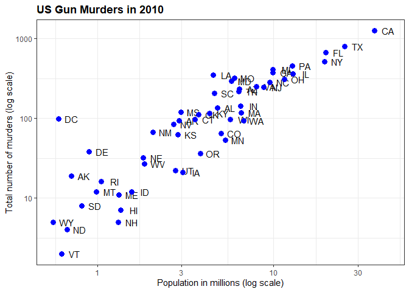
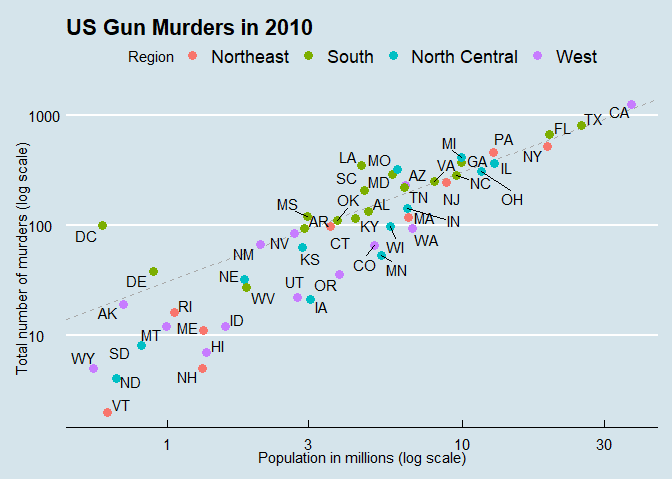
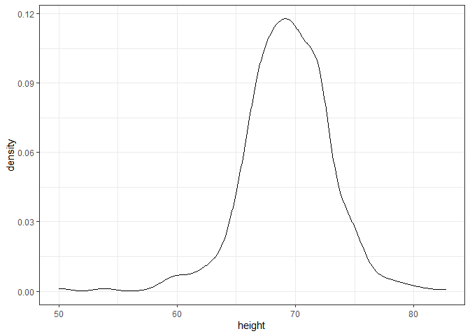
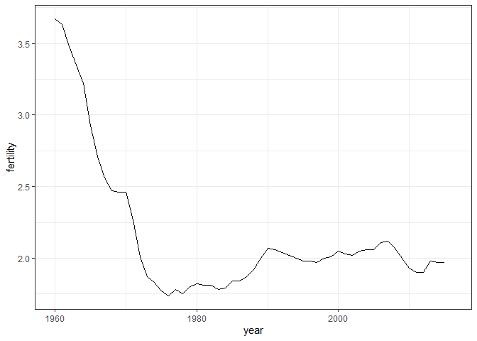
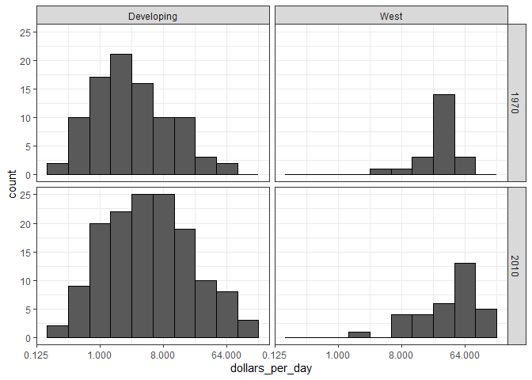

Visualization
================
Matt Bartley
5/14/2020

# Visualization - GG-Plot & Dplyr

## Basics

The geometry layer defines the plot type and takes the format geom\_X
where X is the plot type.

Aesthetic mappings describe how properties of the data connect with
features of the graph (axis position, color, size, etc.) Define
aesthetic mappings with the aes() function.

aes() uses variable names from the object component (for example, total
rather than murders$total).

``` r
ggplot(data = murders)
```

<!-- -->

``` r
murders %>% ggplot()
```

<!-- -->

``` r
p <- ggplot(data = murders)

# add points layer to predefined ggplot object
p + geom_point(aes(population/10^6, total))
```

<!-- -->

``` r
# add text layer to scatterplot
p + geom_point(aes(population/10^6, total)) +
    geom_text(aes(population/10^6, total, label = abb))
```

<!-- -->

Global aesthetic mappings apply to all geometries and can be defined
when you initially call ggplot(). All the geometries added as layers
will default to this mapping. Local aesthetic mappings add additional
information or override the default mappings.

``` r
# simplify code by adding global aesthetic
p <- murders %>% ggplot(aes(population/10^6, total, label = abb))
p + geom_point(size = 3) +
    geom_text(nudge_x = 1.5)
```

<!-- -->

``` r
# local aesthetics override global aesthetics
p + geom_point(size = 3) +
    geom_text(aes(x = 10, y = 800, label = "Hello there!"))
```

<!-- -->

Convert the x-axis to log scale with scale\_x\_continuous(trans =
“log10”) or scale\_x\_log10(). Similar functions exist for the
y-axis.

Add axis titles with xlab() and ylab() functions. Add a plot title with
the ggtitle() function. Add a color mapping that colors points by a
variable by defining the col argument within aes(). To color all points
the same way, define col outside of aes().

Add a line with the geom\_abline() geometry. geom\_abline() takes
arguments slope (default = 1) and intercept (default = 0). Change the
color with col or color and line type with lty.

``` r
# log base 10 scale the x-axis and y-axis
p + geom_point(size = 3) +
    geom_text(nudge_x = 0.05) +
    scale_x_continuous(trans = "log10") +
    scale_y_continuous(trans = "log10")
```

<!-- -->

``` r
# efficient log scaling of the axes
p + geom_point(size = 3) +
    geom_text(nudge_x = 0.075) +
    scale_x_log10() +
    scale_y_log10()
```

<!-- -->

``` r
# add labels and title
p + geom_point(size = 3) +
    geom_text(nudge_x = 0.075) +
    scale_x_log10() +
    scale_y_log10() +
    xlab("Population in millions (log scale)") +
    ylab("Total number of murders (log scale)") +
    ggtitle("US Gun Murders in 2010")
```

<!-- -->

``` r
# redefine p to be everything except the points layer
p <- murders %>%
    ggplot(aes(population/10^6, total, label = abb)) +
    geom_text(nudge_x = 0.075) +
    scale_x_log10() +
    scale_y_log10() +
    xlab("Population in millions (log scale)") +
    ylab("Total number of murders (log scale)") +
    ggtitle("US Gun Murders in 2010")
    
# make all points blue
p + geom_point(size = 3, color = "blue")
```

<!-- -->

``` r
# color points by region
p + geom_point(aes(col = region), size = 3)
```

<!-- -->

## Gun Murders Scatterplot Full Example

The style of a ggplot graph can be changed using the theme() function.

The ggthemes package adds additional themes.

The ggrepel package includes a geometry that repels text labels,
ensuring they do not overlap with each other: geom\_text\_repel().

``` r
# define the intercept
r <- murders %>%
    summarize(rate = sum(total) / sum(population) * 10^6) %>%
    .$rate
    
# make the plot, combining all elements
murders %>%
    ggplot(aes(population/10^6, total, label = abb)) +
    geom_abline(intercept = log10(r), lty = 2, color = "darkgrey") +
    geom_point(aes(col = region), size = 3) +
    geom_text_repel() +
    scale_x_log10() +
    scale_y_log10() +
    xlab("Population in millions (log scale)") +
    ylab("Total number of murders (log scale)") +
    ggtitle("US Gun Murders in 2010") +
    scale_color_discrete(name = "Region") +
    theme_economist()
```

<!-- -->

## Other Types of Plots

### Histograms

geom\_histogram() creates a histogram. Use the binwidth argument to
change the width of bins, the fill argument to change the bar fill
color, and the col argument to change bar outline color.

geom\_density() creates smooth density plots. Change the fill color of
the plot with the fill argument.

geom\_qq() creates a quantile-quantile plot. This geometry requires the
sample argument. By default, the data are compared to a standard normal
distribution with a mean of 0 and standard deviation of 1. This can be
changed with the dparams argument, or the sample data can be scaled.

``` r
data(heights)

p <- heights %>% filter(sex=="Male") %>% ggplot(aes(x=height))

# basic histogram
p + geom_histogram()
```

    ## `stat_bin()` using `bins = 30`. Pick better value with `binwidth`.

<!-- -->

``` r
p + geom_histogram(binwidth=1)
```

<!-- -->

``` r
# histogram with blue fill, black outline, labels and title
p + geom_histogram(binwidth=1, fill="blue", col="black") +
  xlab("Male heights in inches") +
  ggtitle("Histogram")
```

<!-- -->

### Smooth Density Plots

``` r
p + geom_density()
```

<!-- -->

``` r
p + geom_density(fill = "blue")
```

<!-- -->

### Q-Q Plots

``` r
# basic QQ-plot
p <- heights %>% filter(sex == "Male") %>%
    ggplot(aes(sample = height))
p + geom_qq()
```

<!-- -->

``` r
# QQ-plot against a normal distribution with same mean/sd as data
params <- heights %>%
    filter(sex == "Male") %>%
    summarize(mean = mean(height), sd = sd(height))
    p + geom_qq(dparams = params) +
    geom_abline()
```

<!-- -->

``` r
# QQ-plot of scaled data against the standard normal distribution
heights %>%
    ggplot(aes(sample = scale(height))) +
    geom_qq() +
    geom_abline()
```

<!-- -->

## DPLYR Features

### Summarize

``` r
summary(heights)
```

    ##      sex          height     
    ##  Female:238   Min.   :50.00  
    ##  Male  :812   1st Qu.:66.00  
    ##               Median :68.50  
    ##               Mean   :68.32  
    ##               3rd Qu.:71.00  
    ##               Max.   :82.68

``` r
s <- heights %>%
    filter(sex == "Male") %>%
    summarize(avg = mean(height), 
              stdev = sd(height),
              min = min(height),
              max = max(height))

s
```

    ##        avg    stdev min      max
    ## 1 69.31475 3.611024  50 82.67717

### Dot Placeholder

``` r
us_murder_rate <- murders %>%
  summarize(rate = sum(total) / sum(population) * 1000000) %>%
  .$rate

us_murder_rate
```

    ## [1] 30.34555

### Group By

``` r
heights %>% 
  group_by(sex) %>%
  summarize(avg = mean(height),
            stdev = sd(height))
```

    ## # A tibble: 2 x 3
    ##   sex      avg stdev
    ##   <fct>  <dbl> <dbl>
    ## 1 Female  64.9  3.76
    ## 2 Male    69.3  3.61

### Sorting

``` r
murders <- murders %>% mutate(murder_rate = total/population * 100000)
murders %>% arrange(desc(murder_rate)) %>% head()
```

    ##                  state abb        region population total murder_rate
    ## 1 District of Columbia  DC         South     601723    99   16.452753
    ## 2            Louisiana  LA         South    4533372   351    7.742581
    ## 3             Missouri  MO North Central    5988927   321    5.359892
    ## 4             Maryland  MD         South    5773552   293    5.074866
    ## 5       South Carolina  SC         South    4625364   207    4.475323
    ## 6             Delaware  DE         South     897934    38    4.231937

``` r
murders %>% arrange(desc(murder_rate)) %>% top_n(10)
```

    ## Selecting by murder_rate

    ##                   state abb        region population total murder_rate
    ## 1  District of Columbia  DC         South     601723    99   16.452753
    ## 2             Louisiana  LA         South    4533372   351    7.742581
    ## 3              Missouri  MO North Central    5988927   321    5.359892
    ## 4              Maryland  MD         South    5773552   293    5.074866
    ## 5        South Carolina  SC         South    4625364   207    4.475323
    ## 6              Delaware  DE         South     897934    38    4.231937
    ## 7              Michigan  MI North Central    9883640   413    4.178622
    ## 8           Mississippi  MS         South    2967297   120    4.044085
    ## 9               Georgia  GA         South    9920000   376    3.790323
    ## 10              Arizona  AZ          West    6392017   232    3.629527

## Case Study: Trends in World Health & Economics

``` r
head(gapminder)
```

    ##               country year infant_mortality life_expectancy fertility
    ## 1             Albania 1960           115.40           62.87      6.19
    ## 2             Algeria 1960           148.20           47.50      7.65
    ## 3              Angola 1960           208.00           35.98      7.32
    ## 4 Antigua and Barbuda 1960               NA           62.97      4.43
    ## 5           Argentina 1960            59.87           65.39      3.11
    ## 6             Armenia 1960               NA           66.86      4.55
    ##   population          gdp continent          region
    ## 1    1636054           NA    Europe Southern Europe
    ## 2   11124892  13828152297    Africa Northern Africa
    ## 3    5270844           NA    Africa   Middle Africa
    ## 4      54681           NA  Americas       Caribbean
    ## 5   20619075 108322326649  Americas   South America
    ## 6    1867396           NA      Asia    Western Asia

``` r
gapminder %>%
    filter(year == 2015 & country %in% c("Sri Lanka", 
                                         "Turkey", 
                                         "Poland", 
                                         "South Korea", 
                                         "Malaysia",
                                         "Russia",
                                         "Pakistan",
                                         "Vietnam",
                                         "Thailand",
                                         "South Africa")) %>%
  arrange(desc(infant_mortality)) %>%
  select(country, infant_mortality)
```

    ##         country infant_mortality
    ## 1      Pakistan             65.8
    ## 2  South Africa             33.6
    ## 3       Vietnam             17.3
    ## 4        Turkey             11.6
    ## 5      Thailand             10.5
    ## 6     Sri Lanka              8.4
    ## 7        Russia              8.2
    ## 8      Malaysia              6.0
    ## 9        Poland              4.5
    ## 10  South Korea              2.9

``` r
filter(gapminder, year == 1962) %>%
  ggplot( aes(fertility, life_expectancy, color = continent)) +
  geom_point() 
```

<!-- -->

``` r
filter(gapminder, year%in%c(1962, 2012)) %>%
  ggplot(aes(fertility, life_expectancy, col = continent)) +
  geom_point() +
  facet_grid(.~year)
```

<!-- -->

### Examining Life Expectancy by Year

``` r
years <- c(1962, 1980, 1990, 2000, 2012)
continents <- c("Europe", "Asia")
gapminder %>% 
  filter(year %in% years & continent %in% continents) %>%
  ggplot( aes(fertility, life_expectancy, col = continent)) +
  geom_point() +
  facet_wrap(~year) 
```

<!-- -->

### Examining Fertility and Life Expectancy through Time Series

``` r
gapminder %>% 
  filter(country == "United States") %>% 
  ggplot(aes(year, fertility)) +
  geom_line()
```

    ## Warning: Removed 1 row(s) containing missing values (geom_path).

<!-- -->

``` r
countries <- c("South Korea","Germany")
labels <- data.frame(country = countries, x = c(1975,1965), y = c(60,72))

gapminder %>% 
  filter(country %in% countries) %>% 
  ggplot(aes(year, life_expectancy, col=country)) +
  geom_line() +
  geom_text(data=labels, aes(x, y, label=country), size=5) +
  theme(legend.position="none")
```

<!-- -->

``` r
labels2 <- data.frame(country = countries, x = c(1975,1965), y = c(5,3))

gapminder %>% 
  filter(country %in% countries & !is.na(fertility)) %>% 
  ggplot(aes(year, fertility, col=country)) +
  geom_line() +
  geom_text(data=labels2, aes(x, y, label=country), size=5) +
  theme(legend.position="none")
```

<!-- -->

### Log Transformation to Rank GDP Data

We use GDP data to compute income in US dollars per day, adjusted for
inflation.

Log transformations convert multiplicative changes into additive
changes.

Common transformations are the log base 2 transformation and the log
base 10 transformation. The choice of base depends on the range of the
data. The natural log is not recommended for visualization because it is
difficult to interpret.

``` r
gapminder <- gapminder %>%
    mutate(dollars_per_day = gdp/population/365)

past_year <- 1970
gapminder %>%
    filter(year == past_year & !is.na(gdp)) %>%
    ggplot(aes(dollars_per_day)) +
    geom_histogram(binwidth = 1, color = "black")
```

<!-- -->

``` r
gapminder %>%
    filter(year == past_year & !is.na(gdp)) %>%
    ggplot(aes(log2(dollars_per_day))) +
    geom_histogram(binwidth = 1, color = "black")
```

<!-- -->

### Distribution of Income by Geographical Region

Due to the number of regions included in the data, it is difficult to
understand their respective distributions using histrograms or density
plots. Instead, we can use side-by-side box plots, ordered by median
income and colour coded by continent.

Using a log2 scale we are able to discern more meaningfully, the
differences between the lower income and higher income regions. We can
also add the points for individual observations as well to more closely
examine the results.

``` r
p <- gapminder %>%
    filter(year == past_year & !is.na(gdp)) %>%
    mutate(region = reorder(region, dollars_per_day, FUN = median)) %>%    # reorder
    ggplot(aes(region, dollars_per_day, fill = continent)) +    # color by continent
    geom_boxplot() +
    theme(axis.text.x = element_text(angle = 90, hjust = 1)) +
    xlab("")

p + ggtitle("Box Plot of Income by Region") +
  ylab("Income per Day Based on GDP")
```

<!-- -->

``` r
p + scale_y_continuous(trans = "log2") +
  ggtitle("Box Plot of Income by Region - Log2 Scale") +
  ylab("Income per Day Based on GDP")
```

<!-- -->

``` r
p + scale_y_continuous(trans = "log2") + 
  geom_point(show.legend = FALSE) +
  ggtitle("Box Plot of Income by Region - Log2 Scale w/ Observations") +
  ylab("Income per Day Based on GDP")
```

<!-- -->

We can clearly see that Western continents had a significantly higher
income in 1970 based on GDP by population. Let’s see how this compares
over time.

``` r
years <- c(1962, 1980, 1990, 2000, 2012)

p <- gapminder %>%
    filter(year %in% years & !is.na(gdp)) %>%
    mutate(region = reorder(region, dollars_per_day, FUN = median)) %>%    # reorder
    ggplot(aes(region, dollars_per_day, fill = continent)) +    # color by continent
    geom_boxplot() +
    theme(axis.text.x = element_text(angle = 90, hjust = 1)) +
    xlab("") +
    facet_wrap(~year, ncol=1)

p + scale_y_continuous(trans = "log2") +
     geom_point(show.legend = FALSE)
```

<!-- -->

### Closer Examination of Differences in Distributions

Let’s see if we can focus on western regions vs. the remaining ones, and
find a way to make the change between 1970 and 2010 more clear. We can
use mutate to create a grouping of regions base on West vs. the rest
(developing). Facet grid allows us to present the histogram information
on these two very clearly.

We notice from previous plots though that some regions do not have data
for both time points, so we should create a new list of countries to
filter on based on having sufficient data available.

Finally, we can move back to viewing box plots

``` r
# add dollars per day variable and define past year
gapminder <- gapminder %>%
    mutate(dollars_per_day = gdp/population/365)
past_year <- 1970

# define Western countries
west <- c("Western Europe", "Northern Europe", "Southern Europe", "Northern America", "Australia and New Zealand")

# facet by West vs devloping
gapminder %>%
    filter(year == past_year & !is.na(gdp)) %>%
    mutate(group = ifelse(region %in% west, "West", "Developing")) %>%
    ggplot(aes(dollars_per_day)) +
    geom_histogram(binwidth = 1, color = "black") +
    scale_x_continuous(trans = "log2") +
    facet_grid(. ~ group)
```

<!-- -->

``` r
# facet by West/developing and year
present_year <- 2010
gapminder %>%
    filter(year %in% c(past_year, present_year) & !is.na(gdp)) %>%
    mutate(group = ifelse(region %in% west, "West", "Developing")) %>%
    ggplot(aes(dollars_per_day)) +
    geom_histogram(binwidth = 1, color = "black") +
    scale_x_continuous(trans = "log2") +
    facet_grid(year ~ group)
```

<!-- -->

``` r
# define countries that have data available in both years
country_list_1 <- gapminder %>%
    filter(year == past_year & !is.na(dollars_per_day)) %>% .$country

country_list_2 <- gapminder %>%
    filter(year == present_year & !is.na(dollars_per_day)) %>% .$country

country_list <- intersect(country_list_1, country_list_2)

# make histogram including only countries with data available in both years
gapminder %>%
    filter(year %in% c(past_year, present_year) & country %in% country_list) %>%    # keep only selected countries
    mutate(group = ifelse(region %in% west, "West", "Developing")) %>%
    ggplot(aes(dollars_per_day)) +
    geom_histogram(binwidth = 1, color = "black") +
    scale_x_continuous(trans = "log2") +
    facet_grid(year ~ group)
```

<!-- -->

``` r
p <- gapminder %>%
    filter(year %in% c(past_year, present_year) & country %in% country_list) %>%
    mutate(region = reorder(region, dollars_per_day, FUN = median)) %>%
    ggplot() +
    theme(axis.text.x = element_text(angle = 90, hjust = 1)) +
    xlab("") + scale_y_continuous(trans = "log2")
    
 p + geom_boxplot(aes(region, dollars_per_day, fill = continent)) +
     facet_grid(year ~ .)
```

<!-- -->

``` r
 # arrange matching boxplots next to each other, colored by year
 p + geom_boxplot(aes(region, dollars_per_day, fill = factor(year)))
```

<!-- -->
